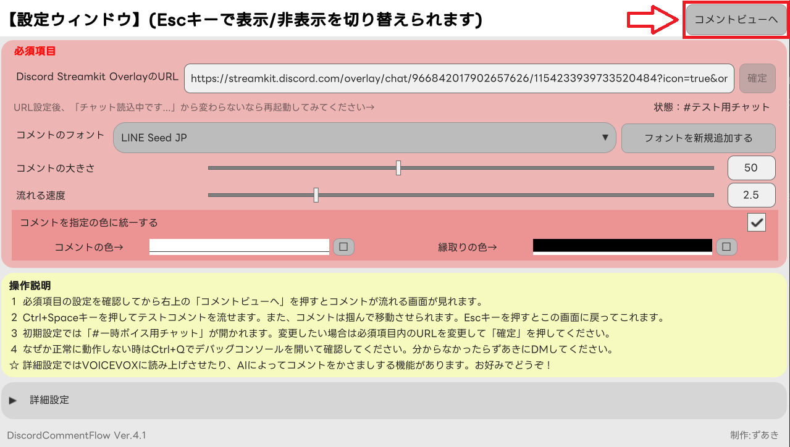
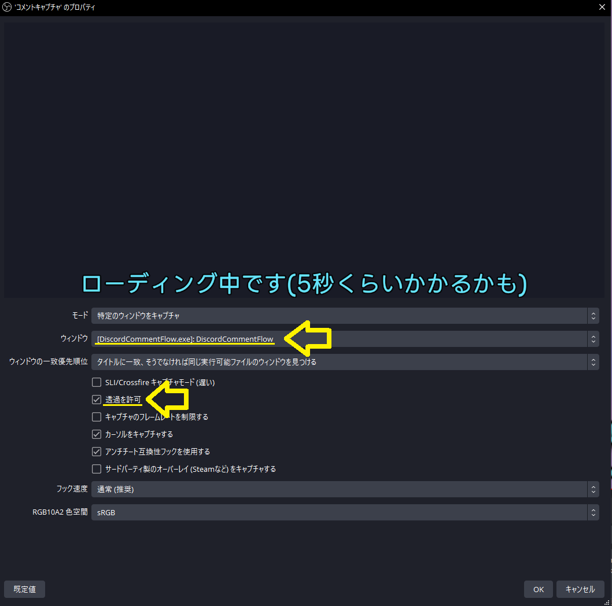
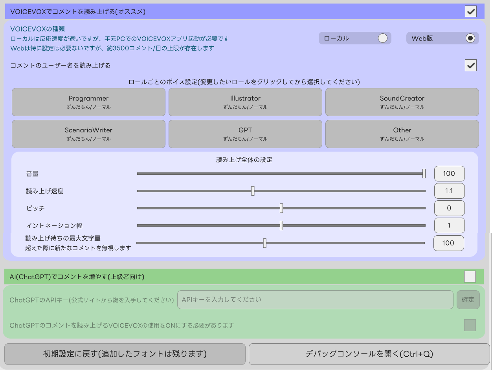
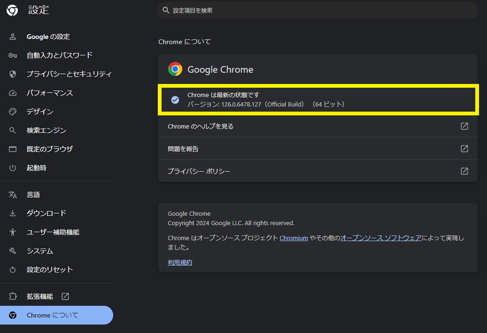
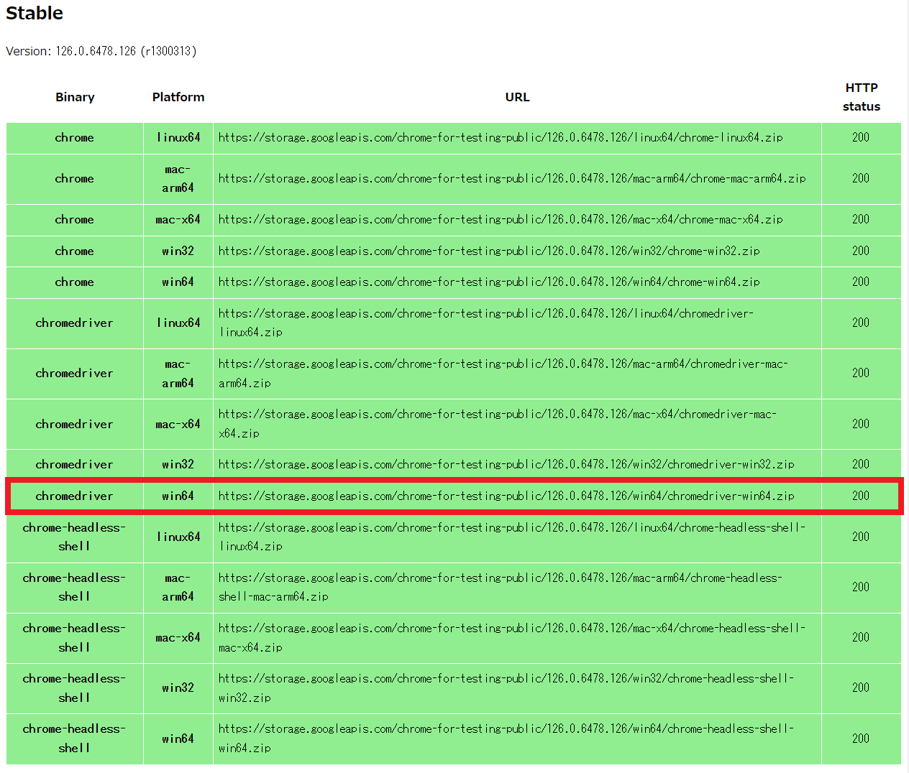

# DiscordCommentFlow
Discordのコメントをニコニコ動画みたいに配信画面上に流すためのツールです

## 機能
- コメントを取得して流す
- 広島大学ゲーム制作同好会内のロール毎にボイスを変更できる
  - ロールごとの色が反映される
- 外部からフォントファイルを追加できる
- VOICEVOXによる読み上げ
- ChatGPTによる自演コメント生成

## 使い方
1. OBSStudioを起動
1. DiscordCommentFlowを起動
1. 「コメントビューへ」を押す

1. OBSStudioでソースの追加>ゲームキャプチャと選択し、対象ウィンドウにDiscordCommentFlowを選び、透過を許可にチェック

1. お好みに合わせて詳細設定一覧をいじる

## 仕組み
- UIはUI Toolkitにて作成
- [Discord Streamkit Overlay](https://streamkit.discord.com/overlay)をSeleniumでスクレイピングして取得
    - [Discord Streamkit Overlay](https://streamkit.discord.com/overlay)はローカルで動いているDiscordから情報を受け取り、ブラウザ画面にコメントを表示する公式サービス
- コメントの大きさや配置、スピードを計算してお互いに重ならないように位置を調整
- 動的にFontAssetファイルとFontマテリアルを生成して適用
- VOICEVOX API(公式)または[WEB版VOICEVOX API（高速）](https://voicevox.su-shiki.com/su-shikiapis/)(有志)を用いて読み上げ音声生成、ダウンロードして流す
- ChatGPT APIを用いて取得コメントに類似した自演コメントを自動生成して流す

## 不具合など
**(追記)v5.0のアプデにより、ChromeDriverの自動更新機能を追加しました。**

Q. 起動時にChromeDriverのエラーが出る

A. ChromeDriverがChromeとバージョンが違う可能性があります [Chrome for Testingサイト](https://googlechromelabs.github.io/chrome-for-testing/)から自身のChromeと同じバージョンのものを導入してください

